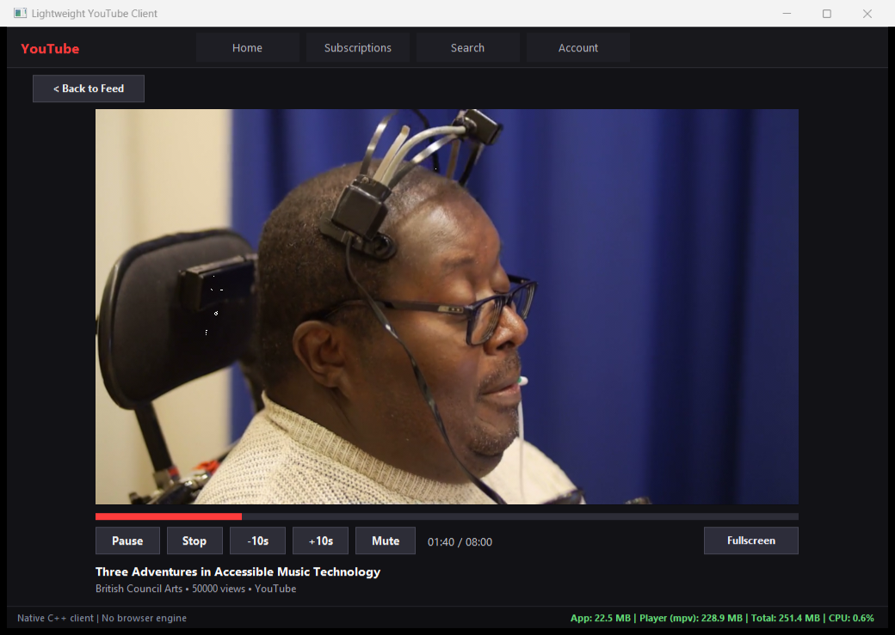
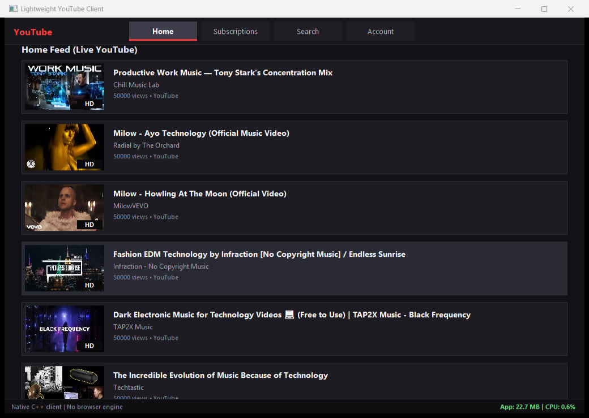
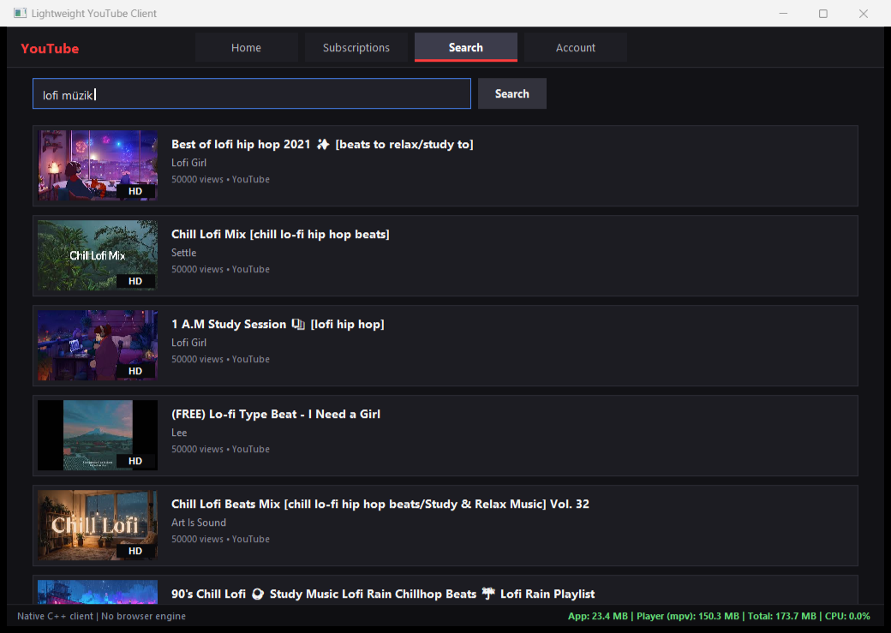

# Lightweight YouTube Client

A native Windows YouTube client written in C++17. No Chromium, no Electron, no WebView.
The UI is plain Win32 + GDI, and video is played by [mpv](https://mpv.io) with
[yt-dlp](https://github.com/yt-dlp/yt-dlp).

> Unofficial project. Not affiliated with, endorsed by, or connected to YouTube or Google.



## Why I built this

My old laptop had **4 GB of RAM**. Watching YouTube on it was painful. A browser with a
single YouTube tab took a big share of that memory, the CPU was busy the whole time,
and everything else I had open slowed down with it.

Two things make a browser heavy for this job:

1. **The browser itself.** A JavaScript app, a page layout engine and several helper
   processes, all running just to show one video.
2. **The video codec.** YouTube sends browsers AV1 or VP9 whenever it can. GPUs only got
   AV1 hardware decoding around 2020, and many older laptops can't decode VP9 in hardware
   either. When the GPU can't decode the codec, the browser decodes it on the CPU, and that
   is where the fan noise and heat come from. Almost every GPU from the last ~12 years can
   decode **H.264** in hardware.

So I wrote a client that does only the job I need: browse, search and play. It uses a small
native window for the UI, hands the video straight to mpv, and **asks YouTube for H.264 first**.

## How much lighter is it?

Same video in both players:
[Big Buck Bunny 60fps](https://www.youtube.com/watch?v=aqz-KE-bpKQ) at **1280×720, 60 fps**.
Chrome used a clean, separate profile with no extensions and no other tabs. Each number is
the average over 30 seconds with the player window in front. The scripts also checked that
the video really played the whole time (it moved forward ~33 s in every run) and recorded
which codec and decoder were actually used. I ran the whole set **twice**; where the two runs
differ, both numbers are shown.

Test machine: Intel Core i5-13420H (12 threads), 16 GB RAM, Intel UHD graphics with AV1 decoding.
Measured on 17 September 2026.

### On a PC whose GPU can't decode AV1 or VP9 (typical older laptop)

The GPU still decodes H.264, so this app keeps using the GPU. A browser has to decode AV1 on
the CPU. I simulated this by turning off hardware video decoding in Chrome.

| | This app | Chrome | Difference |
|---|---:|---:|---:|
| What was decoded | H.264, on the GPU | AV1, on the CPU | |
| CPU (share of all 12 threads) | **1.9–2.0 %** | **7.7–7.8 %** | ~4× less |
| CPU in "cores busy" | 0.22–0.24 | 0.93 | Chrome keeps almost one full core busy |
| Private memory | **217 MB** | **910–939 MB** | ~4× less (~700 MB saved) |

Almost a whole core of a 2023 CPU is a lot for an older or low-power laptop CPU, which is
slower per core. I haven't measured on such a machine yet, so treat that part as expected, not proven.

### On a modern PC (both players use the GPU)

| | This app | Chrome | Difference |
|---|---:|---:|---:|
| What was decoded | H.264, on the GPU | AV1, on the GPU | |
| CPU (share of all 12 threads) | 1.9–2.0 % | 2.7–2.8 % | a bit less |
| Private memory | **217 MB** | **846–861 MB** | ~4× less (~630–640 MB saved) |
| Processes | 2 | 11 | |

On a modern PC, the CPU saving is small and the real win is memory.

### What each codec costs on the CPU (same player, mpv)

Every stream decoded on the CPU, so only the codec changes:

| Codec (720p60, CPU decoding) | CPU (all threads) | Cores busy |
|---|---:|---:|
| H.264 | 2.6–3.1 % | 0.31–0.38 |
| VP9 | 2.9–3.1 % | 0.34–0.38 |
| AV1 | 4.3–4.5 % | 0.51–0.54 |

On this CPU, H.264 and VP9 cost about the same in software, and AV1 about 1.4–1.7× more. Chrome
needed 0.93 cores for the same AV1 stream, so roughly 0.4 cores are the browser's own overhead
on top of the decoding. The biggest CPU saving comes from **getting the video decoded on the
GPU at all**, and H.264 is the codec that older GPUs can do.

**Good to know**

- **Private memory** is the fairest memory number. Chrome's working set counts shared pages
  once for every process, which makes Chrome look bigger (~1.3 GB) than it really is.
- **This is a simulation.** On a real old laptop, YouTube may send the browser VP9 instead of
  AV1. VP9 is cheaper to decode than AV1 (see the table above), but it still runs on the CPU.
- **H.264 needs more data.** For the same picture quality it uses more bandwidth than VP9/AV1.
  If your connection is slow but your PC is modern, set `"video_codec": "any"`.
- **Some older videos only exist in H.264.** For those, even Chrome gets H.264 and decodes it on
  the GPU, so the only difference is memory
  (see [results for an H.264-only video](tools/bench/results/V5Asw04DsD8/codec_summary.md)).
- The app dropped 11 frames right after start with GPU decoding (in both runs), and 0–2 in the
  other setups.
- One machine and one video, two runs per setup. Your numbers will be different.
- Raw results: [run 1](tools/bench/results/aqz-KE-bpKQ/codec_summary_run1.md),
  [run 2](tools/bench/results/aqz-KE-bpKQ/codec_summary.md).

When no video is playing, the app uses about **23 MB** (working set) and 5 MB of private
memory. mpv only starts when you open the first video. After that it stays running in the
background, so the next video opens faster.

### Run the benchmark yourself

Double-click [`tools/bench/run_codec_bench.bat`](tools/bench) (it needs Google Chrome) and don't
touch the mouse for about 7 minutes. It opens the app and Chrome by itself, measures each setup,
and writes a table to `tools/bench/results/<video id>/codec_summary.md`. To test a different
video, pass its id: `run_codec_bench.bat V5Asw04DsD8`.

The browser measurement only counts processes that use the benchmark profile, so your normal
browser and apps that embed WebView2 are not included. The app also shows live numbers and
what it is decoding in its status bar, for example
`App: 22.2 MB | Player (mpv, h264 720p60 HW): 219.7 MB | Total: 242.0 MB | CPU: 1.3%`.

## Screenshots

| Home feed | Search |
|---|---|
|  |  |

## Features

- Home feed and search, including non-ASCII search text such as `lofi müzik`. No API key needed.
- Embedded mpv playback with play/pause, stop, ±10 s, a seek bar, mute and fullscreen
  (the controls come back when you move the mouse)
- Prefers H.264 video, which older GPUs can decode in hardware (configurable)
- Thumbnail cache with a fixed memory limit (16 MB by default)
- UI capped at 30 FPS, and all network work runs on background threads
- Live RAM/CPU readout for the app and the player

### Keyboard shortcuts (video screen)

| Key | Action |
|---|---|
| Space | Play / pause |
| ← / → | Seek −10 s / +10 s |
| F or Enter | Toggle fullscreen |
| M | Mute |
| Esc | Exit fullscreen / back to feed |

Double-click the video to toggle fullscreen.

## Building (Windows)

Requirements:

- A C++17 compiler: [LLVM-MinGW](https://github.com/mstorsjo/llvm-mingw) (what I use), MinGW-w64 or MSVC
- [CMake](https://cmake.org) 3.16 or newer, and [Ninja](https://ninja-build.org)
- **mpv** and **yt-dlp**. These are not in the repository (`mpv.exe` is larger than GitHub's
  100 MB file limit).
  - Download an mpv Windows build from https://mpv.io/installation/ and extract it into `tools/mpv/`
    (so you have `tools/mpv/mpv.exe`).
  - Put `yt-dlp.exe` from https://github.com/yt-dlp/yt-dlp/releases into `tools/mpv/` too.

```powershell
cmake -B build -S . -G Ninja -DCMAKE_BUILD_TYPE=Release
cmake --build build

# run (the build copies tools/, config/ and assets/ next to the exe)
.\build\youtube-client.exe

# unit tests
.\build\run_tests.exe
```

Settings are in [`config/app_config.json`](config/app_config.json): feed and search sizes,
cache size, FPS cap, and an optional YouTube Data API key. Video settings:

| Setting | Default | Meaning |
|---|---|---|
| `video_codec` | `"h264"` | `"h264"` asks for H.264 first (best for older GPUs). `"any"` lets yt-dlp pick (usually AV1/VP9, less bandwidth). `"vp9"` / `"av1"` force a codec. |
| `max_video_height` | `720` | Highest resolution to request |
| `hardware_decoding` | `true` | Decode on the GPU when possible |

## How it works

```
Win32 window + GDI renderer  (UI thread, 30 FPS)
 ├─ Screens: Home · Search · Subscriptions · Video · Account
 ├─ ThreadPool + EventQueue   (HTTP, parsing, thumbnail decoding off the UI thread)
 ├─ ThumbnailCache            (bounded LRU)
 └─ PlayerController → WindowsPlayerBackend
        └─ mpv.exe --wid=<child window>   (JSON IPC over a named pipe, overlapped I/O)
               └─ yt-dlp                  (resolves the stream: H.264 first, 720p max)
```

The UI and the player are separate processes. The UI never waits on the player: mpv is
started and controlled from background threads, so a slow stream never freezes the window.

## Known limitations

- Windows only.
- Subscriptions show sample channels, and login (OAuth device flow) is experimental. Real
  subscriptions need your own Google API credentials.
- View counts in lists are placeholders.
- The app isn't DPI-aware yet, so on displays with Windows scaling above 100 % the UI
  looks slightly soft (Windows stretches it).
- The feed and search results come from YouTube's public web pages, so a YouTube change can
  break them until the parser is updated.

## Credits

- [mpv](https://mpv.io) for playback
- [yt-dlp](https://github.com/yt-dlp/yt-dlp) for stream extraction
- [stb_image](https://github.com/nothings/stb) for thumbnail decoding
